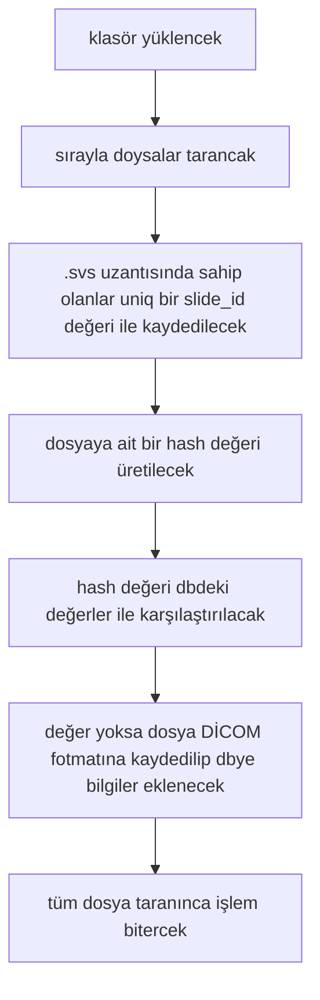

# SVS to DICOM Dönüştürücü
bir klasörde bulunan tüm SVS dosyalrını , DICOM formatına dönüştüren ve zip halinde döndüren bir servis 
## Neler kullandım 
postgresql veritabanı, loglama işlemi ve dbnin kullanılması için bir docker compose dosyası eklendi.

## Kütüphaneler 
ORM için SQLAlchemy
APİ servisi için FastAPİ 
svs dosyalarını okumak için OpenSlide
svs dosyasını dicoma çevirmek için  WsiDicomizer
thread yönetiminin otomatik yapılması için  concurrent.futures
db için de psycopg2 

## Kurulum ve Çalıştırma
- Projeyi ayağa kaldırmak için terminalde `python main.py` komutunu çalıştırabilirsiniz.
- Yükleme testi için ana dizindeki `test_upload.html` dosyasını tarayıcıda açabilirsiniz.

NOT: arayüz deneme için oluşturuldu 